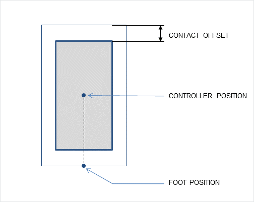
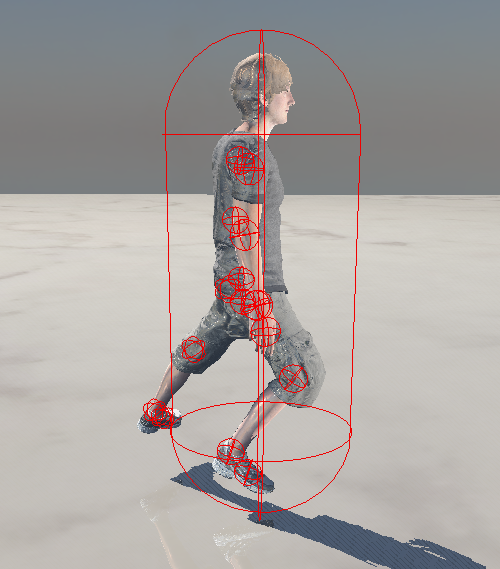
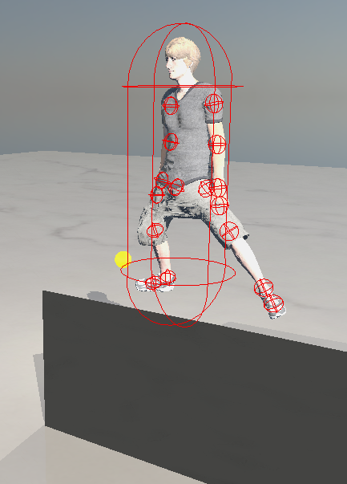

# 3주차 진행상황

## 목표

경사면에 대한 캐릭터 애니메이션 IK 구현.

## 진행상황

- 경사면 구조물과 캐릭터의 충돌처리.
- 캐릭터 정지 상태 시 지형에 따라 양다리에 IK 처리 시도.

### 구현 상황

엔비디아 physx를 이용하여 경사 구조물과 캐릭터 간 충돌 처리하도록 구현.
- 경사 구조물과 캐릭터의 충돌체를 physx 내부에 생성.
- 캐릭터의 이동 방향과 속도에 따라 physx에서 시뮬레이션 한 후, 변화한 위치를 가져와 캐릭터를 렌더링.
- 아래 gif는 physx와 렌더러 간 캐릭터의 이동이 잘 반영되고 있음을 보여줌.     

양다리 IK 적용 시도.
- 구상 당시 계획은 정지 상태 애니메이션에서 key 데이터 적용 -> 캐릭터 위치(발 부분)에 따라 IK를 적용하는 것이었음.
- 이를 적용하기 위해 foot position을 가져와 양발들의 target position을 재조정한 뒤 IK처리를 하려고 함.   
    
- 그러나 양다리가 이상하게 처리됨.    
     
    
- 생각한 문제점은 다음과 같음.
    - 양다리에 IK를 처리하기 위해서는 양발과 지형에 대해 충돌처리를 따로 거쳐야 함. 지금 방식은 IK를 적용하는 것이 아님.

### 추후 계획
- IK 처리 과정 수정.
- 계단 구조물에서 IK 처리 시도.
