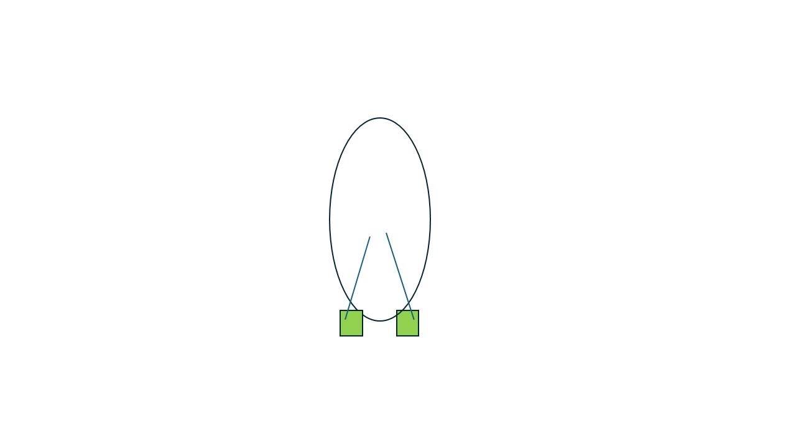
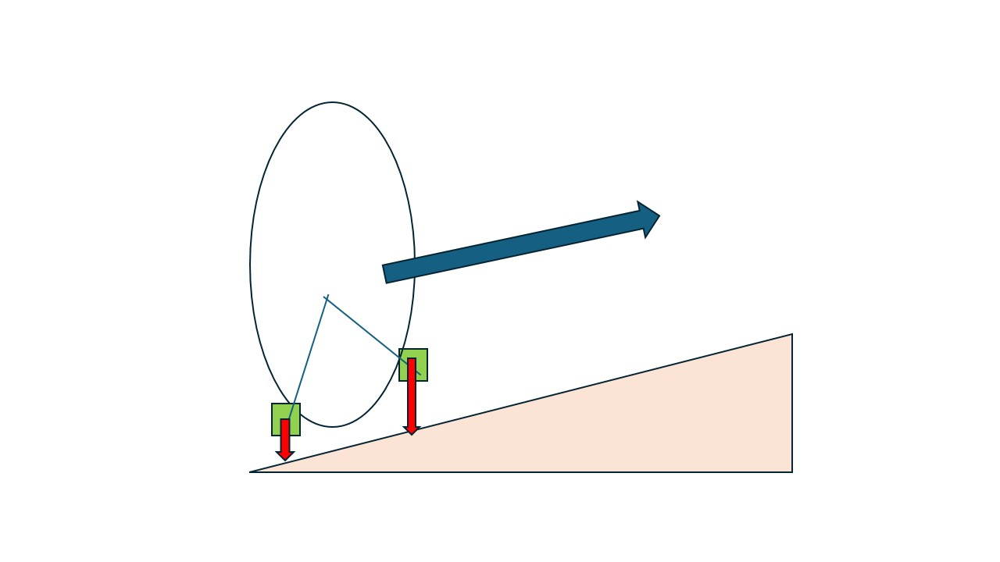
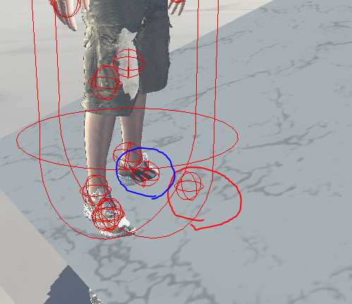
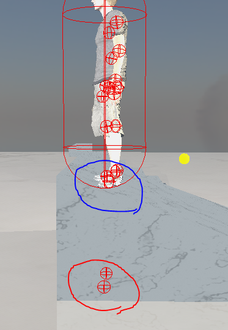
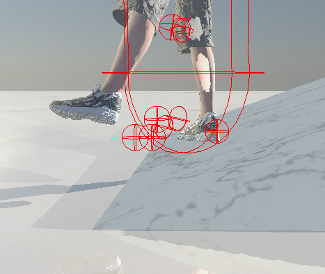
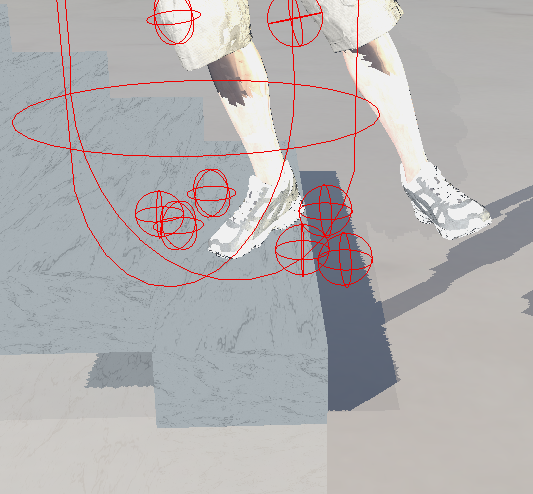

# 5주차 진행상황

## 목표

경사면과 계단에 대한 캐릭터 애니메이션 IK 구현.

## 진행상황

- 캐릭터 정지 상태 시 지형에 따라 양다리에 IK 처리 시도 및 오류 수정.

### 구현 상황

양발에 대한 충돌처리.
양발에 대한 이동을 추적하기 위해 간단한 박스 충돌체를 생성함.    
     
경사면과 같은 지형 이동 시 수직 방향에 대해 충돌하는 위치를 계속 추적.     
     
추적된 위치를 바탕으로, 서 있는 경우에 해당 위치를 target position으로 설정 후 IK 계산을 진행함.    

과정을 정리하면,    
캐릭터 전체 이동방향 결정 -> 애니메이션 키 데이터 적용 -> 적용된 상태에서 양발의 target position을 추적 -> 추적된 target position은 캐릭터 정지 상태 시 양발 IK 계산에 사용.     

문제점
- target position 위치 오류로 인한 제대로 된 IK 적용이 이상함.      
     
(빨간원: target position, 파란원: end-effector)      
   
(빨간원: target position, 파란원: end-effector)    
    
위 경우는 target position이 계속된 위치 조정으로 인해 IK 계산시 떨리는 상황 발생.     
      
target position이 계단 높낮이에 따라 설정되지 않아 떨리는 상황 발생.      

### 추후 계획
- target position 위치 지정 과정 수정
- 전체적인 오류 수정
