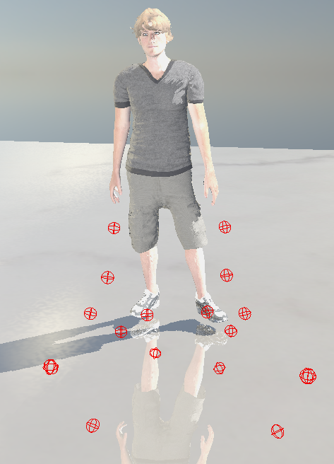

# 6주차 진행상황

## 목표

경사면과 계단에 대한 캐릭터 애니메이션 IK 구현.

## 진행상황

- 양다리에 IK 처리 오류 수정.

     
physx 상에서 양발에 대한 위치가 렌더링 쪽과 동기화 하기 위해 정밀도를 올려야 한다고 판단함.    
     
       
이를 위해서 기존 관절 위치를 가져오는 방식에 개선이 필요했음.    
기존 방식에서는 애니메이션 키 데이터를 이용한 관절 위치들이 이상하게 계산되어, 각 관절마다 보정 값을 넣어줬음.   
    
보정값이 없을 경우 이런식으로 기즈모들이 위치하게 됨.  
    
보정값을 적용해야 제대로 위치가 표시됨.   
      

      
따라서 이를 개선하기 위해 고민함.    
      
처음에는 현재 사용하고 있는 Assimp 모델 임포트 라이브러리에서 데이터를 읽어들인 데이터에 문제가 있다고 생각했음.   
현재 사용하고 있는 캐릭터 데이터의 일부 뼈들의 local transform이 아무 정보가 없는 것을 발견했음.   
초기에 t-pose 상태 캐릭터 로드 시, 캐릭터가 이상하게 렌더링 되었던 것도 여기에 있다고 판단함.    
    

이를 위해 기존 사용하고 있던 모델 임포트 라이브러리를 FBX Sdk로 교체하려 시도함.   
그러나 생각보다 쉽지 않았음.   
기존 Assimp에서는 모델 데이터를 자체적으로 한번 처리한 뒤, 사용자에 맞게 데이터를 재구성하는 과정을 거쳤다면,    
FBX SDK에서는 fbx 파일 데이터를 처음부터 재구성해야 했음. 그에 따른 다양한 옵션이 존재해 상당히 시간이 걸렸음.    
제대로 된 임포트가 되지 않았던 탓인지 렌더링도 이상하게 됨.    
 

## 잠정적 결론 및 향후 계획
기존 모델 임포트에는 문제가 없다(?)     
캐릭터 애니메이션 자체는 문제가 없고, 프로젝트 내 처리 과정에서 이슈가 있다고 판단함.   
조금 더 고민해보고 진전이 없다면, 기존에 사용하던 보정 값 적용 방식을 사용하여 진행할 예정.    
