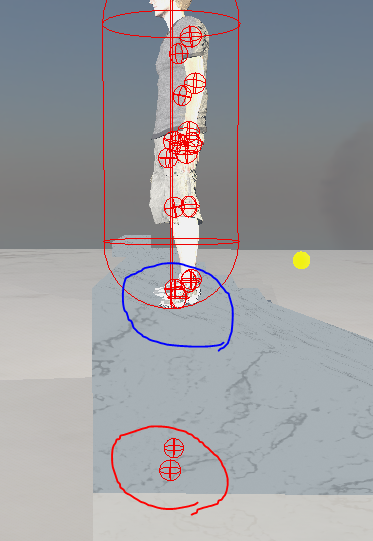
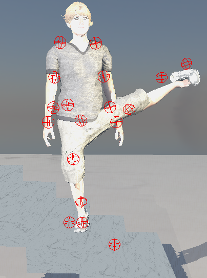

# 6주차 진행상황

## 목표

경사면과 계단에 대한 캐릭터 애니메이션 IK 구현.

## 진행상황

- 양다리에 IK 처리 오류 수정.

     
- Joint 위치 문제 해결.    
     

   
해결 전.  

   
해결 후.    

문제의 원인은 애니메이션 데이터의 root bone(hip)이 상대위치가 아닌 절대 위치를 가지고 있었음. 그래서 이를 반영하기 위해 관절 위치 행렬 계산 시 root bone의 offset을 적용하여 해결함.    

- End-Effector target position 문제 해결.     
       
     
해결 전.     
     

   
   
해결 후.

      
### 발견된 문제점
    
    
    
    
      
캐릭터 중심 위치로 인한 문제라고 판단함.    

## 향후 계획     
캐릭터 중심 문제 수정.
