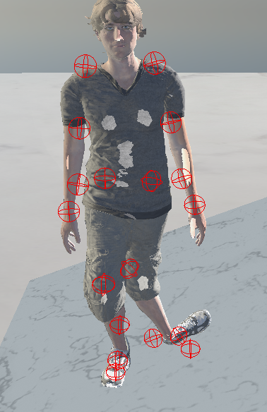
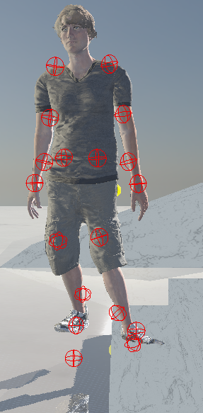

# 8주차 진행상황

## 목표

경사면과 계단에 대한 캐릭터 애니메이션 IK 구현.

## 진행상황

문제점    
    
    
    
    

현재 자코비안 행렬을 이용하여 각 관절에 적용할 회전 값들을 찾고 있음.    
그러나 제대로된 결과가 나오지 않아 문제 원인을 찾아보고자 함.    
      
우선, 기존에 적용하고 있었던 제한을 풀고 초기 상태(서 있는 상태)에서 관찰해보기로 함.     
       
target position과 end effector간 거리가 최소일 텐데 계속해서 어느 순간 부터 누적해서 회전 값을 계산하고 있었음.     
    
    
    
   
target position에 문제가 있나 싶어 조금씩 조정해도 동일한 상황 발생함.    
      
two-bone-ik로 joint 회전값을 바로 계산하는 방법이 있어 한번 적용해 봄.    
https://www.ryanjuckett.com/analytic-two-bone-ik-in-2d/
   
그러나 결과 또한 이상하게 적용됨.    
   
